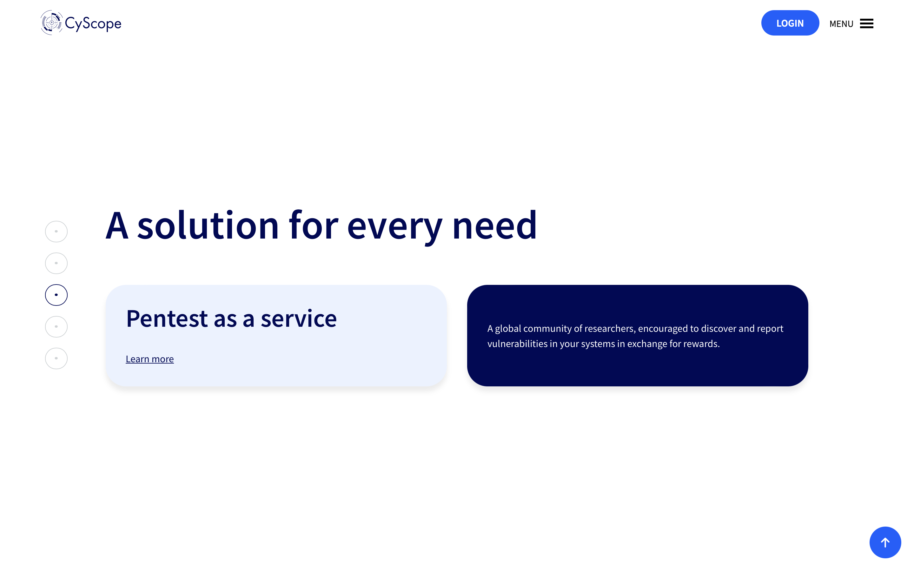
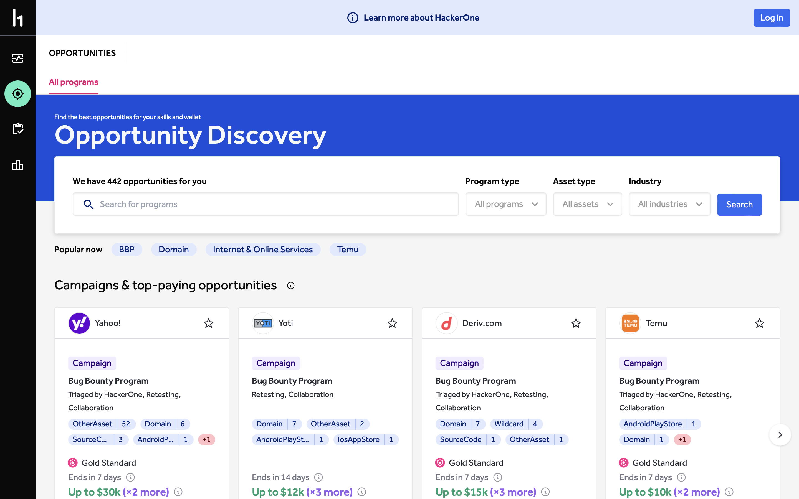
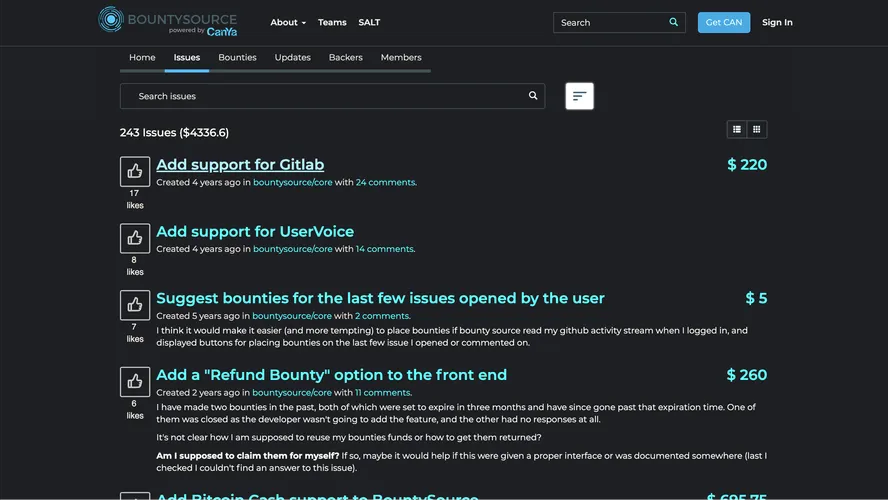
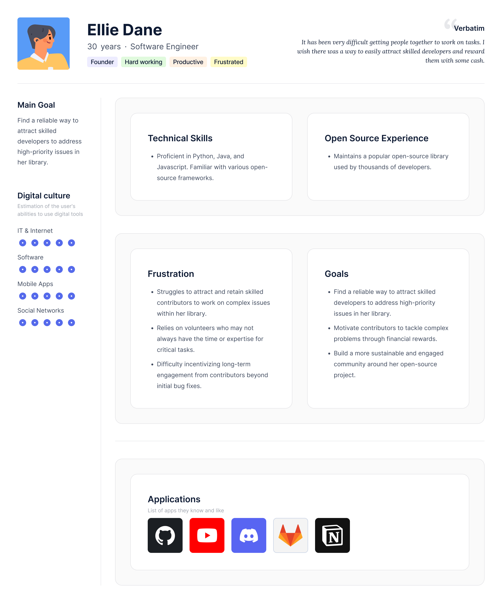
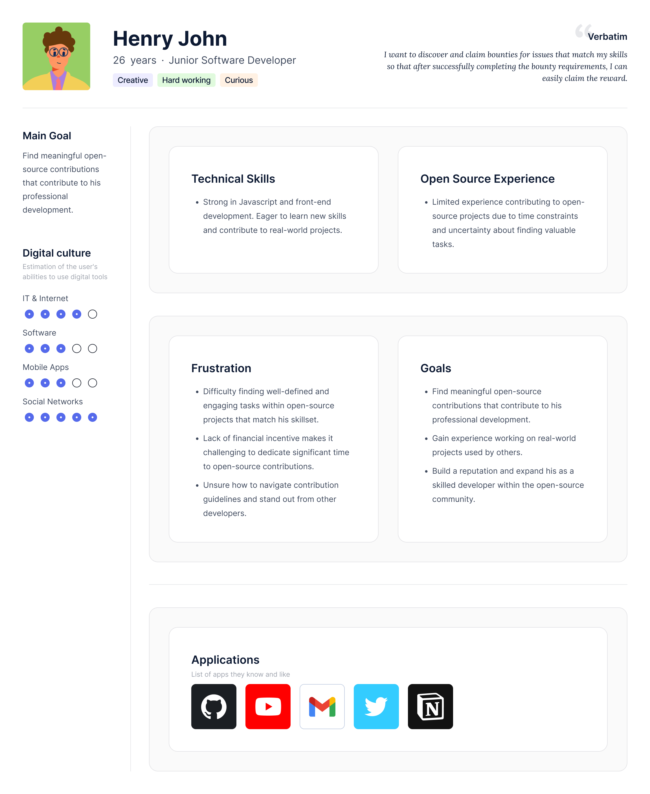

# Bounty System - A Unified Concept

## Introduction

A study on how incentives affect product performance by Chakravarty et al. (2007) shows that social considerations and monetary rewards significantly affect various aspects of product performance. Also, Ma (2023) stated in his study of incentives for digital content contribution that it is important to align the type of incentive (monetary, social, intrinsic) with the unique characteristics of the content and the contributors/players’ motivations and preferences. Since many of the players in the [oss.gg](http://oss.gg) platform are young developers, incentives such as cash, merchandise, gadgets, cryptocurrency, etc. would be big motivators to contribute. 

[Oss.gg](http://Oss.gg) aims to revolutionise open-source communities by fostering a more engaging and rewarding experience for both project maintainers and contributors. A key feature within the product  is the **Bounty System**, designed to incentivise high-quality contributions through financial rewards. This document outlines the product requirements for the oss.gg Bounty System, focusing on the initial implementation with bounty amounts ranging from $5 to $500.

This document outlines the functionalities, requirements, and success metrics for the oss.gg bounty system.

## Problem statement

The open-source community thrives on passionate developers, designers, product managers, community managers, etc. who contribute their expertise and time to build and maintain critical software. However, retaining these valuable contributors can be a challenge. Senior engineers often face competing demands, limited free time, and a constant barrage of project options. Also, the traditional open-source contribution models often lack the structure, incentives, and recognition needed to retain their long-term engagement. Hackathons are one example of an existing solution that can be resource-intensive and not very sustainable over time. Bounties provide a focused method of rewarding particular contributions without burdening project maintainers. This unique approach attracts senior engineers, motivates them to tackle critical issues, and fosters long-term engagement within the open-source community. 

## Competitive analysis

### **Existing Platforms**

Before we dive into the nitty-gritty details of our Bounties feature, it's crucial to learn from existing solutions. Bounty programs often rely on dedicated platforms to handle the technical aspects. Bounty Hosting Platforms serve as a marketplace that links *bounty providers* and *bounty hunters*. These platforms manage various tasks such as

- presenting bounties with details including task description, reward amount, and deadline.
- securing the bounty funds in escrow until successful completion
- providing communication channels between the bounty hunters and project maintainers,
- maintaining reputation systems for both parties, and
- offering dispute resolution mechanisms in the event of disagreements.

One notable player in this space is **Algora**, a well-established platform for managing open-source bounties.

| Strengths | Weaknesses |
| --- | --- |
| Established user base and community | Limited gamification and engagement elements |
| Streamlined process for posting and claiming bounties | Perceived as a standalone platform, rather than an integrated solution |
| Integration with popular code hosting platforms (e.g., GitHub) | Lack of customisation options for project maintainers |
| Secure payment processing and escrow system | Potential for abuse (e.g., low-quality submissions for quick payouts) |

While Algora has paved the way for open-source bounties, our vision for oss.gg's Bounties feature is to go beyond a transactional platform. We aim to create a holistic, gamified experience that seamlessly integrates with our existing contributor levels, automation, and community-building efforts.

### **How the bounties are used within OSSHack**

- **User Interface**
    - A dashboard shows various projects and under each project, a group of tasks.
    - Each task listed is a card that shows
        - a summary of what needs to be done,
        - the bounty (or “Awarded” if it has been awarded), and
        - a truncated description of the task.
    - Opening each card, users can see description paragraphs, rationale, reward, link to GitHub issue and a CTA to submit.
- **How it works**
    - The task remains open until it is solved and awarded.
    - Multiple contributors can attempt to claim a bounty at a time.
    - If a submission has been completed but not awarded, a new contributor will be competing against previous submissions.
    - Bounties are awarded once a PR is merged and are claimed via [Tremendous](https://www.tremendous.com/).
- **UX Observations**
    - Users might want to know how many submissions have been received.
    - There is no date on any of the tasks. There is no way to know which is most recent.
    - The links to the issues on GitHub are broken.

Bug bounty programs offer monetary rewards to ethical hackers for successfully discovering and reporting a vulnerability or bug to the application's developer. Bug Bounty Platforms such as **CyScope,** **HackerOne,** enable the creation of bounties linked to open-source project repositories. This feature simplifies the process for developers to locate relevant bounties and contribute directly to the project. Other bug bounty platforms can be found [here](https://github.com/disclose/bug-bounty-platforms).

|  |  |
| --- | --- |

### **Open-Source Specific Platforms**

Several platforms cater specifically to open-source bounties. **[BountySource](https://alternativeto.net/software/bountysource/about/)** is an example of these platforms, and they integrate with popular version control systems like Git and offer features like linking to specific issues in the project repository, rewarding contributions and awarding bounties based on merit, and offering community reputation for contributions. 

BountySource

## **Goals**

- Establish oss.gg as a central platform for incentivized open-source contributions
- Motivate and reward skilled contributors for their efforts.
- Increase the number and quality of contributions to open-source projects on oss.gg.
- Provide project maintainers with a flexible tool to attract talent for critical issues.

## **User stories**

1. As a project maintainer, I want to set up bounties with clear acceptance criteria and financial rewards for specific issues within my projects so that I can attract skilled developers and incentivize high-quality solutions, ultimately improving the development of my projects.
2. As a contributor, I want to discover and claim bounties for issues that match my skills so that after successfully completing the bounty requirements and having my solution approved I can receive the designated financial reward through a secure payment system.

## **User Persona 1 (Project Maintainer)**

## **User Persona 2 (Contributor)**

## **The Solution**

1. **The project maintainer initiates a bounty:**
    - Selects an issue and sets a bounty amount within the designated range.
    - Clearly defines the acceptance criteria for completing the bounty.
2. **Players discover and claim bounty:**
    - Browse bounties based on filters matching their skills and interests.
    - View the details of each bounty and assess their ability to fulfill the requirements.
    - Claim a bounty by submitting a Pull Request (PR) that addresses the issue.
3. **The project manager reviews submissions.**
    - Evaluates submitted PRs based on the predefined acceptance criteria.
    - Collaborates with contributors to ensure quality and adherence to guidelines.
4. **Bounty Award and Claim:**
    - Once a PR is reviewed and merged, the bounty is awarded to the contributor.
    - Integration with a secure payment gateway facilitates the seamless transfer of fund

## **Development Timeline**

### Phase 1: Prioritize core functionalities like bounty creation, claiming, tracking, and payouts for initial development and launch. This allows for faster rollout and user feedback gathering.

<aside>
⌛ Estimated Time: 8 weeks

</aside>

| Weeks | Core Functionalities |
| --- | --- |
| Week 1-2 | • Design and develop core functionalities for bounty creation (amount, deadline, basic eligibility criteria, documentation for dispute resolution).
• Develop a secure backend system for storing and managing bounty data. |
| Week 3-4 | • Develop bounty listing functionality, including displaying details and filtering options for contributors.
• Implement a user interface for contributors to submit claims for bounties. |
| Week 5-6 | • Build bounty status tracking features for both maintainers and contributors.
• Integrate with a secure payment platform like Tremendous  to facilitate payouts to contributors. |
| Week 7-8 | • Testing, bug fixing, and finalization of Phase 1 functionalities.
• User interface refinement and documentation creation. |

### Phase 2: Based on user feedback and platform usage data, consider developing advanced features like detailed eligibility criteria, multiple payment methods, and dispute resolution in subsequent phases.

<aside>
⌛ Estimated Time: 6 weeks

</aside>

| Weeks | Core Functionalities |
| --- | --- |
| Week 9-10 | • Integrate with other secure payment platforms to facilitate payouts to contributors.
• Develop detailed eligibility criteria |
| Week 11-12 | • Notify players of new bounty
• Edit and update bounties
• Partial payouts for partially correct submissions |
| Week 13-14 | • Testing, bug fixing, and finalization of Phase 2 functionalities.
• User interface refinement and documentation creation. |

**OKRs**

**Objective:** Increase developer engagement and incentivize high-quality contributions within the oss.gg community.

**Key Result 1:** Grow the number of active contributors claiming bounties by 20% within the next quarter.

- Measure: Track the number of unique contributors who claim bounties over a defined period (e.g., weekly, monthly).

**Key Result 2:** Achieve a 70% completion rate for claimed bounties within the next quarter.

- Measure: Calculate the percentage of claimed bounties that are successfully completed and payouts awarded.

**Stretch Goal:** Introduce a gamification element (e.g., leaderboard) to the bounty system and achieve a 10% increase in weekly bounty claims within the next quarter.

- Measure: Track the weekly number of bounty claims before and after implementing the gamification element.

**Initiatives:**

- Launch the oss.gg bounty system with a user-friendly interface for creating and managing bounties.
- Implement a marketing campaign to raise awareness of the bounty system among potential contributors.
- Integrate the bounty system with the existing level system to ensure appropriate bounty allocation based on contributor experience.
- Develop clear guidelines and best practices for setting up effective bounties.
- Continuously monitor and iterate on the bounty system based on user feedback and usage data.

## Technical Considerations

1. Bounty Setup
    - Bounties can be applied while creating an issue or to an existing issue.
    - Bounty should be editable e.g.if the issue is more complex than expected, bounty could be increased.
    - Players with the required level get notified of every new bounty.
    - When a PR merge is not successful, the task gets unassigned from the player and becomes open to other players.
2. Bounty Assignment
    - A player can only be assigned a bounty-task if they have all the required skills, or level for that task.
    - Only one player can be assigned to a single bounty-task as the bounty will be released to the player upon successful PR merge only if the issue has been assigned to them.
    - Issues are assigned to players on a first come, first served basis.
3. Bounty Payment Structure
    - Bounty will be released only to the assigned player upon successful PR merge.
    - Bounties can be offered as digital cash which can be sent to other payment platforms. An example is Tremendous. However, it is not available in all countries (Nigerian residents cannot receive money using Paypal and many other international digital payment platforms).
    - Support multiple payment methods (credit/debit cards, digital wallets)
    - Ensure compliance with relevant financial regulations and security standards.
4. Integration with Existing Infrastructure:
    - Seamless integration with the oss.gg web app, API, and GitHub app
    - Leverage existing authentication, authorization, and user management systems
    - Utilize the existing contributor levels and automation frameworks
5. Integration with Development Tools: Project maintainers can add links to bounty programs directly within the project repository (README file or specific issue labels). This makes it easy for developers to discover and contribute to bounties. For specific bug fixes or code improvements, bounties can be linked to Continuous Development (CD) pipelines. Successful completion of automated tests upon code merge can trigger bounty payouts.
6. Security & Fraud Prevention
    - To prevent abuse, we need robust mechanisms to ensure only legitimate claims are processed. This could involve:
        - Automatic checks to verify successful code merge and completion of any additional bounty criteria.
        - A manual review process for high-value bounties.
    - We need robust security measures to protect sensitive information like contributors/players’ details, bounty details and vulnerability reports.
    - Player Verification: It is important to verify that players are not bots, and that they do not have multiple accounts trying to claim a single bounty.
7. Documentation: Clear guidelines and processes ensure fair resolution of disagreements H contributors and project maintainers.
8. Quality Control: Merit-based review is crucial to ensure high-quality contributions even with bounties.
9. Community Dynamics: Bounties should complement, not replace, the core open-source contribution model based on volunteerism and community collaboration.

## Financial Considerations

Funding bounties requires a sustainable source of income for the project, potentially through donations or sponsorships. Using third party services such as escrow also requires some costs. Moreover, running out of funds after starting a bounty program can damage community trust. In this [link](https://fundedby.community/funding-open-source-projects/), there are 10 different ways to source for funding for open source projects. Some of these include:

1. Bounty Payouts: The primary financial cost will be the bounties themselves. We need to determine a sustainable model for covering these costs. Here are some options:
    - Project Maintainers: Maintainters can choose to fund bounties themself or through their organization's budget. For instance, if the [oss.gg](http://oss.gg) project has a budget, a portion can be allocated for bounties.
    - Transaction Fees: Implement a small transaction fee on claimed bounties to cover platform overhead. This fee should be minimal to avoid discouraging contributors.
    - Sponsorship Model: Explore partnerships with companies or organizations willing to sponsor bounties for specific projects or skillsets. This can be a win-win, attracting talent and promoting the sponsor's brand within the developer community.
    - Donations: We will encourage community donations specifically for bounties.
    - Monetising parts of the project
    - Advertising
    - Selling add-ons/plugins, merchandise
    - Offering Paid Support and Services, etc.
2. Transparency and Trust
    - Clear Pricing: Maintain complete transparency around bounty amounts and any associated fees. This builds trust with both maintainers and contributors.
    - Be transparent about the bounty program's funding sources, reward structure, and selection criteria. This also helps to build trust with the developer community.
    - Secure Payment Processing: Integrate with a reputable payment gateway like tremendous that ensures secure and timely payouts to contributors.
    - Dispute Resolution: Establish a clear process for handling any disputes that might arise regarding bounty claims. This could involve a team review or mediation to ensure fair outcomes.
3. Bounty Tiers: Defining the bounty amounts for different issue categories is essential to incentivize contributions effectively. The following tiers are proposed for Formbricks:
    - $5: Low-priority issues or minor enhancements.
    - $10: Moderate-priority issues or feature requests.
    - $25: High-priority issues or critical bug fixes.
    - $50: Complex issues or significant feature implementations.
    - $100: Challenging tasks or major refactoring efforts.
    - $150: Advanced features or integration development.
    - $250: Critical infrastructure improvements or performance optimizations.
    - $500: Mission-critical tasks or large-scale project milestones.
4. Budgeting and Tracking
    - Cost Estimation: There is a need to estimate the potential cost of bounties before launching the program. The average bounty amount, number of anticipated submissions, and success rate all need to be considered.
    - Tracking and Reporting: Track bounty expenses and the impact of the program on project development. This helps refine the strategy and predict sustainability.
5. Additional Considerations
    - Tax Implications: Depending on the location and the bounty structure (cryptocurrency vs. traditional payments), there might be tax implications for both the project and the players. A tax professional should be consulted to be sure.
    - Recovering the costs: The costs of implementing the bounty feature can be recovered using the suggested means of sourcing funds above.

## UX Considerations

Delivering an exceptional user experience is paramount to the success of the Bounties feature. We need to ensure that both project maintainers and contributors find the entire process intuitive, engaging, and enjoyable. Here's how we'll approach the UX for each user group:

**For Project Maintainers:**

- Bounty Management Dashboard: design an intuitive centralized dashboard for creating, managing, and tracking bounties. This includes setting:
    - Amount, deadline, eligibility.
    - Viewing bounty applications and statuses.
    - Securely initiating payouts.
    - Progress tracking (e.g., number of submissions, claimed bounties)
    - Contributor details and activity
    - Payout status and history
    - Reporting and analytics tool
- Notifications and Alerts: Maintainers will receive timely notifications and alerts for critical events, such as bounty claims, submissions, and payment-related activities.

**For Players:**

- Bounty Issue Detail via Email:
    - For contributors, when they receive the email notification and click on the link, they should see:
    - The issue title and a brief description.
    - The bounty amount.
    - Any additional requirements or deadlines.
- Gamified Bounty Board: It will feature:
    - Visual representation of bounty amounts and rewards
    - Leaderboards and achievement showcases
    - Social sharing and collaboration features
- Ensure bounties are clearly displayed within the issue list, highlighting the amount and deadline.
- The claiming process should be straightforward, requiring minimal steps for submitting claims and providing evidence of work.
- Clear and timely communication about bounty status, reviews, and payouts is crucial.
- Progress Tracking and Notifications: Contributors will have access to a personalized dashboard that tracks their bounty progress, submissions, and payouts. They'll also receive a reminder notification to pull a request after 36 hours of claiming to work on the issue.
- Achievement and Recognition System: Successful bounty completions will be celebrated through achievements, badges, and other recognition elements, fostering a sense of accomplishment and motivation.

Other UX Considerations

- Multiple secure payment options
- Ease of use
- Transparency and fairness
- Search and filter options
- Mobile responsiveness
- Accessibility for players with disabilities
- Open to non-developers

- References
    - Chakravarty, S., Haruvy, E., & Wu, F. (2007). The link between incentives and product performance in open source development: an empirical investigation. *Global Business and Economics Review*, *9*(2/3), 151. [https://doi.org/10.1504/gber.2007.013698](https://doi.org/10.1504/gber.2007.013698)
    - Ma, X. (2023). Incentives for Digital Content Contribution. *Management for Professionals*, 15–40. [https://doi.org/10.1007/978-981-99-6737-7_2](https://doi.org/10.1007/978-981-99-6737-7_2)
    - [https://alternativeto.net/software/bountysource/about/](https://alternativeto.net/software/bountysource/about/)
    - [https://github.com/disclose/bug-bounty-platforms](https://github.com/disclose/bug-bounty-platforms)
    - [https://docs.gitopia.com/interchain-bounty-tutorial/index.html](https://docs.gitopia.com/interchain-bounty-tutorial/index.html)
    - [https://fundedby.community/funding-open-source-projects/](https://fundedby.community/funding-open-source-projects/)